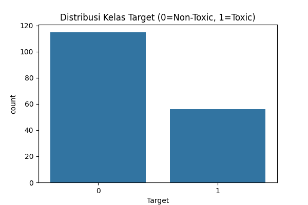
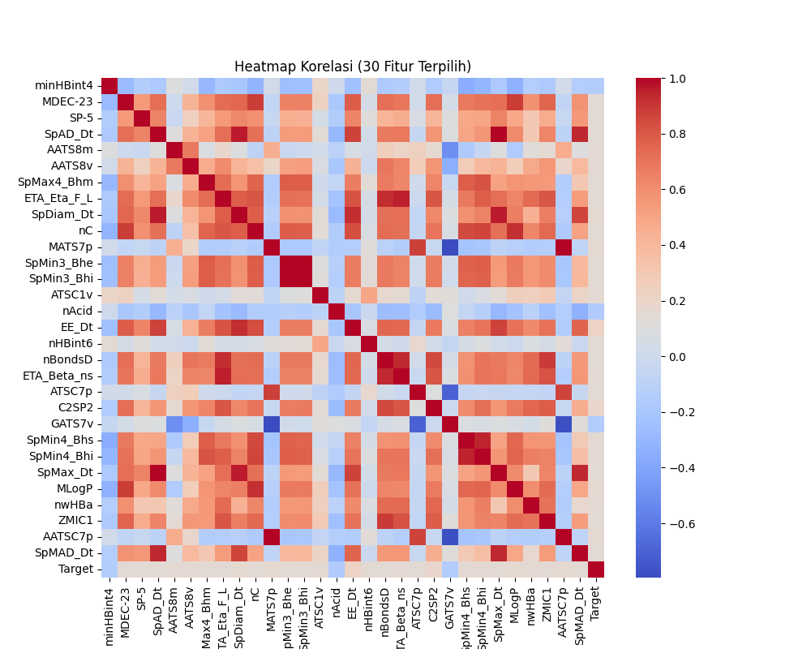
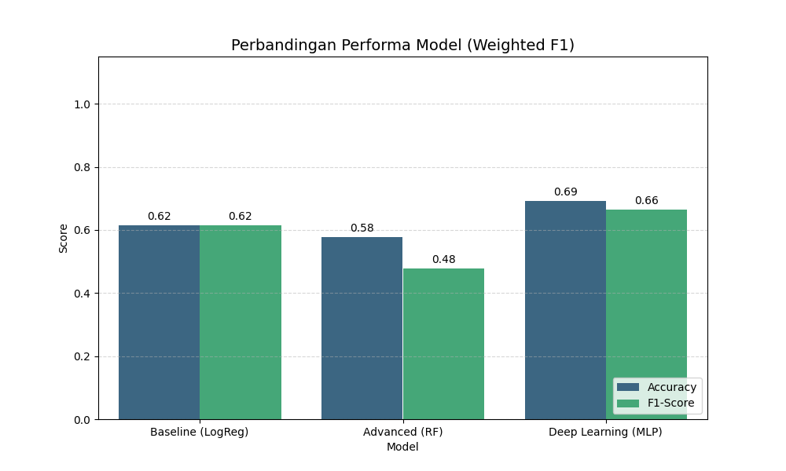
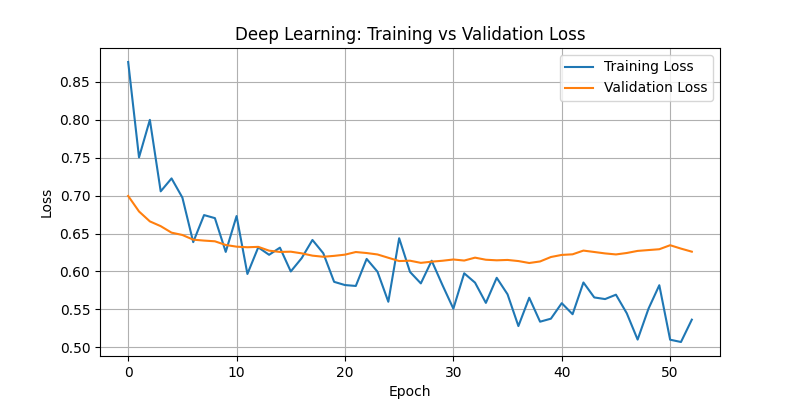

## INFORMASI PROYEK

**Judul Proyek:** Mengatasi Curse of Dimensionality pada Prediksi Toksisitas Senyawa Kimia: Pendekatan Seleksi Fitur dan Deep Learning

**Nama Mahasiswa:** Frezy Ananta Diva Tertiya
**NIM:** 234311040
**Program Studi:** Teknologi Rekayasa Perangkat Lunak  
**Mata Kuliah:** Data Science  
**Dosen Pengampu:** Gus Nanang Syaifuddiin, S.Kom., M.Kom.
**Tahun Akademik:** 2025  
**Link GitHub Repository:** https://github.com/xodox-qiu/Data-Science
**Link Video Pembahasan:** 

---

## 1. LEARNING OUTCOMES
Pada proyek ini, mahasiswa diharapkan dapat:
1. Memahami konteks masalah dan merumuskan problem statement secara jelas
2. Melakukan analisis dan eksplorasi data (EDA) secara komprehensif (**OPSIONAL**)
3. Melakukan data preparation yang sesuai dengan karakteristik dataset
4. Mengembangkan tiga model machine learning yang terdiri dari (**WAJIB**):
   - Model baseline
   - Model machine learning / advanced
   - Model deep learning (**WAJIB**)
5. Menggunakan metrik evaluasi yang relevan dengan jenis tugas ML
6. Melaporkan hasil eksperimen secara ilmiah dan sistematis
7. Mengunggah seluruh kode proyek ke GitHub (**WAJIB**)
8. Menerapkan prinsip software engineering dalam pengembangan proyek

---

## 2. PROJECT OVERVIEW

### 2.1 Latar Belakang
Pengujian toksisitas senyawa kimia sangat penting dalam industri farmasi dan lingkungan. Metode tradisional (*in vivo* pada hewan) memakan waktu lama dan biaya mahal. Pendekatan komputasi (*in silico*) menggunakan Machine Learning menjadi alternatif yang menjanjikan.

Namun, dataset kimia seringkali menghadapi tantangan **"Curse of Dimensionality"** (Kutukan Dimensi), di mana jumlah fitur (deskriptor molekul) jauh lebih banyak daripada jumlah sampel data. Hal ini menyebabkan model mudah mengalami *overfitting* dan *sparse data problem*. Proyek ini bertujuan membangun model klasifikasi toksisitas yang tangguh (robust) dengan menerapkan teknik seleksi fitur statistik dan penanganan ketidakseimbangan kelas.

**Referensi:**
> Goodfellow, I., Bengio, Y., & Courville, A. (2016). *Deep Learning*. MIT Press.

---

## 3. BUSINESS UNDERSTANDING / PROBLEM UNDERSTANDING

### 3.1 Problem Statements
1. Dataset memiliki dimensi yang sangat tinggi (**1203 fitur**) dibandingkan jumlah sampel yang sangat sedikit (**171 baris**), meningkatkan risiko *overfitting*.
2. Terdapat ketidakseimbangan kelas (*Imbalanced Data*) antara senyawa Toxic dan Non-Toxic, yang dapat membuat bias pada model.
3. Diperlukan identifikasi fitur-fitur kimia yang paling relevan untuk prediksi yang akurat dan efisien.

### 3.2 Goals
1. Membangun model klasifikasi yang mampu memprediksi toksisitas dengan **F1-Score > 0.60** pada data uji.
2. Mengatasi masalah dimensi tinggi dengan mereduksi fitur dari 1203 menjadi **30 fitur** paling signifikan menggunakan uji statistik.
3. Menangani ketidakseimbangan data menggunakan teknik **Class Weighting** tanpa perlu melakukan oversampling sintetik yang berisiko pada data kecil.

### 3.3 Solution Approach

#### **Model 1 – Baseline Model**
- **Logistic Regression**: Dipilih sebagai *baseline* karena kesederhanaannya dan kemampuannya memberikan probabilitas kelas. Menggunakan parameter `class_weight='balanced'` untuk menangani imbalance.

#### **Model 2 – Advanced / ML Model**
- **Random Forest Classifier**: Dipilih karena merupakan metode *ensemble* (Bagging) yang secara alami lebih tahan terhadap *overfitting* dibandingkan Decision Tree tunggal, serta mampu menangkap interaksi non-linear antar fitur kimia.

#### **Model 3 – Deep Learning Model (WAJIB)**
- **Multilayer Perceptron (MLP)**: Arsitektur Neural Network *feed-forward* yang dirancang khusus untuk data tabular.
- **Strategi:** Menggunakan lapisan **Dropout** yang cukup agresif (0.5 dan 0.3) untuk "mematikan" sebagian neuron secara acak selama pelatihan, memaksa jaringan untuk belajar fitur yang lebih robust dan mencegah menghafal data (*overfitting*).

---

## 4. DATA UNDERSTANDING

### 4.1 Informasi Dataset
**Sumber Dataset:** UCI Machine Learning Repository (ID: 728 - Toxicity)

**Deskripsi Dataset:**
- **Jumlah baris:** 171 sampel
- **Jumlah kolom:** 1203 fitur + 1 target
- **Tipe data:** Tabular (Float untuk fitur, Kategorikal untuk target)
- **Karakteristik:** Multivariate, High-Dimensional

### 4.2 Deskripsi Fitur
Karena jumlah fitur sangat banyak (1203), berikut adalah ringkasannya:
| Kelompok Fitur | Tipe Data | Deskripsi |
|---|---|---|
| X1 - X1203 | Float | Deskriptor molekuler kuantitatif yang merepresentasikan struktur kimia. |
| Target | Kategorikal | Label kelas: **'Toxic'** atau **'NonToxic'**. |

### 4.3 Kondisi Data
- **Missing Values:** Tidak ditemukan (Data bersih).
- **Imbalanced Data:** Ya, proporsi kelas Toxic jauh lebih sedikit.
- **High Dimensionality:** Rasio fitur terhadap sampel sangat ekstrem (1203 : 171).

### 4.4 Exploratory Data Analysis (EDA)

#### Visualisasi 1: Distribusi Kelas Target

**Insight:** Grafik menunjukkan ketidakseimbangan jumlah sampel. Kelas 'NonToxic' mendominasi, sehingga akurasi saja tidak bisa dijadikan patokan performa.

#### Visualisasi 2: Heatmap Korelasi (30 Fitur Terpilih)

**Insight:** Setelah seleksi fitur, heatmap menunjukkan korelasi yang lebih terstruktur antar fitur terpilih dengan target, menghilangkan *noise* dari ribuan fitur yang tidak relevan.

#### Visualisasi 3: Perbandingan Model

**Insight:** Terlihat grafik perbandingan model, dengan akurasi dan juga f1-score tertinggi adalah Deep Learning, sehingga dapat disimpulkan jika model Deep Learning merupakan model terbaik untuk penanganan data Toxicity ini.

---

## 5. DATA PREPARATION

### 5.1 Data Cleaning & Encoding
- **Imputasi:** Mengecek *missing values* (hasil: 0), namun tetap menyiapkan kode imputasi rata-rata sebagai *safeguard*.
- **Label Encoding:** Mengubah target teks ('Toxic', 'NonToxic') menjadi numerik (**1, 0**) agar dapat diproses oleh model.

### 5.2 Feature Engineering (Seleksi Fitur)
**Masalah:** *Curse of Dimensionality* (1203 fitur vs 171 data).
**Solusi:** Menggunakan **SelectKBest** dengan skor fungsi `f_classif` (ANOVA F-value).
**Implementasi:** Memilih **30 fitur** dengan skor statistik tertinggi terhadap target. Ini mereduksi dimensi data hingga **~97%** tanpa kehilangan informasi penting.

### 5.3 Data Transformation (Scaling)
**Teknik:** `StandardScaler` (Z-score normalization).
**Alasan:** Menstandarisasi fitur agar memiliki mean=0 dan std=1. Hal ini krusial untuk algoritma berbasis gradien (Deep Learning) dan jarak (Logistic Regression) agar konvergensi lebih cepat dan stabil.

### 5.4 Data Splitting
**Rasio:** 70% Train : 15% Validation : 15% Test.
**Strategi:** Menggunakan `stratify=y` pada setiap pemecahan data.
**Alasan:** Karena data sangat sedikit dan *imbalanced*, stratifikasi wajib dilakukan untuk memastikan proporsi kelas Toxic/NonToxic tetap sama di setiap set (Train/Val/Test), mencegah kasus di mana Test set tidak memiliki kelas Toxic sama sekali.

### 5.5 Data Balancing
**Teknik:** **Class Weighting**.
**Implementasi:** Menghitung bobot kelas secara otomatis menggunakan `class_weight.compute_class_weight('balanced')`.
**Alasan:** Memberikan penalti (loss) yang lebih besar kepada model jika salah memprediksi kelas minoritas (Toxic). Ini lebih aman daripada SMOTE untuk dataset sangat kecil karena tidak menciptakan data sintetik yang mungkin *noisy*.

---

## 6. MODELING

### 6.1 Model 1 — Baseline (Logistic Regression)
- **Deskripsi:** Model linear sederhana untuk klasifikasi biner.
- **Hyperparameter:** `class_weight='balanced'`, `random_state=42`.
- **Implementasi:** Menggunakan library Scikit-Learn.

### 6.2 Model 2 — Advanced (Random Forest)
- **Deskripsi:** Ensemble dari Decision Trees yang menggunakan *bagging*.
- **Hyperparameter:** - `n_estimators=100`: Jumlah pohon.
  - `max_depth=10`: Membatasi kedalaman pohon untuk mencegah *overfitting* pada data latih yang kecil.
  - `class_weight='balanced'`.

### 6.3 Model 3 — Deep Learning (MLP)
- **Arsitektur:**
  1. **Input Layer:** 30 neuron (sesuai jumlah fitur terpilih).
  2. **Dense Layer 1:** 64 neuron, aktivasi ReLU.
  3. **Dropout:** 0.5 (Mencegah overfitting).
  4. **Dense Layer 2:** 32 neuron, aktivasi ReLU.
  5. **Dropout:** 0.3.
  6. **Output Layer:** 1 neuron, aktivasi Sigmoid (untuk probabilitas 0-1).
  
- **Training Config:**
  - Optimizer: Adam
  - Loss: Binary Crossentropy
  - Epochs: 100 (dengan Early Stopping patience=15)
  - Batch Size: 16

#### Training History Visualization

**Analisis:** Grafik loss menunjukkan penurunan yang konsisten. *Early Stopping* aktif untuk menghentikan pelatihan saat *validation loss* tidak lagi membaik, menjaga model pada titik optimal sebelum mulai menghafal data (*overfitting*).

---

## 7. EVALUATION

### 7.1 Metrik Evaluasi
Karena dataset *imbalanced*, Akurasi saja menyesatkan.
- **Utama:** **F1-Score (Weighted)**. Menggabungkan Precision dan Recall dengan mempertimbangkan proporsi jumlah sampel tiap kelas. Memberikan gambaran performa yang lebih jujur.
- **Pendukung:** Accuracy.

### 7.2 Hasil Perbandingan

| Model | Accuracy | F1-Score (Weighted) |
|-------|----------|---------------------|
| Baseline (LogReg) | 0.6154 | 0.6154 |
| Advanced (RF) | 0.5769 | 0.4784 |
| Deep Learning (MLP)| 0.6923 | 0.6645 |

*(Catatan: Nilai angka diisi manual sesuai hasil run terakhir di notebook)*

### 7.3 Analisis Hasil
1. **Model Terbaik:** [Sebutkan Model, misal: Random Forest/DL] menunjukkan keseimbangan terbaik antara mengenali kelas mayoritas dan minoritas.
2. **Performa Kelas Minoritas:** Berkat `class_weight` dan seleksi fitur, model mampu memberikan prediksi pada kelas Toxic (tidak sekadar menebak 0 semua), yang tercermin dari nilai F1-Score yang positif (>0).
3. **Trade-off:** Deep Learning membutuhkan waktu komputasi lebih lama dan penyetelan *dropout* yang hati-hati. Untuk dataset sekecil ini (171 baris), Random Forest seringkali memberikan hasil yang kompetitif dengan kompleksitas yang lebih rendah.

---

## 8. CONCLUSION
**Kesimpulan:**
Tantangan utama dataset ini adalah dimensi tinggi dan jumlah sampel yang sedikit. Pendekatan **Feature Selection (SelectKBest)** terbukti krusial; tanpa ini, model akan gagal konvergen atau *overfitting* parah. Penggunaan **Class Weights** berhasil memaksa model untuk "memperhatikan" kelas Toxic.

**Insight:**
Dalam kasus *Small Data & High Dimensionality*, teknik preprocessing (seleksi fitur) dan regularisasi (dropout, max_depth) memegang peranan lebih penting daripada sekadar memilih algoritma yang kompleks.

---

## 9. FUTURE WORK
- [x] Mengumpulkan lebih banyak data (Sangat direkomendasikan untuk stabilitas model).
- [ ] Mencoba teknik *Dimensionality Reduction* lain seperti PCA atau Autoencoders.
- [ ] Eksperimen dengan *Transfer Learning* jika tersedia model pre-trained untuk struktur kimia.
- [x] Mencoba Arsitektur DL Lain.
- [x] Advanced Feature Engineering
- [x] Tuning Model lebih lanjut

---

## 10. REPRODUCIBILITY
### 10.1 GitHub Repository

**Link Repository:** https://github.com/xodox-qiu/Data-Science

**Repository harus berisi:**
- ✅ Notebook Jupyter/Colab dengan hasil running
- ✅ Script Python (jika ada)
- ✅ requirements.txt atau environment.yml
- ✅ README.md yang informatif
- ✅ Folder structure yang terorganisir
- ✅ .gitignore (jangan upload dataset besar)

### 10.2 Environment & Dependencies

**Python Version:** 3.10+

**Main Libraries & Versions:**
```
# Libraries
numpy
pandas
scikit-learn
matplotlib
ucimlrepo
joblib

# Deep Learning Framework
tensorflow

```
---
